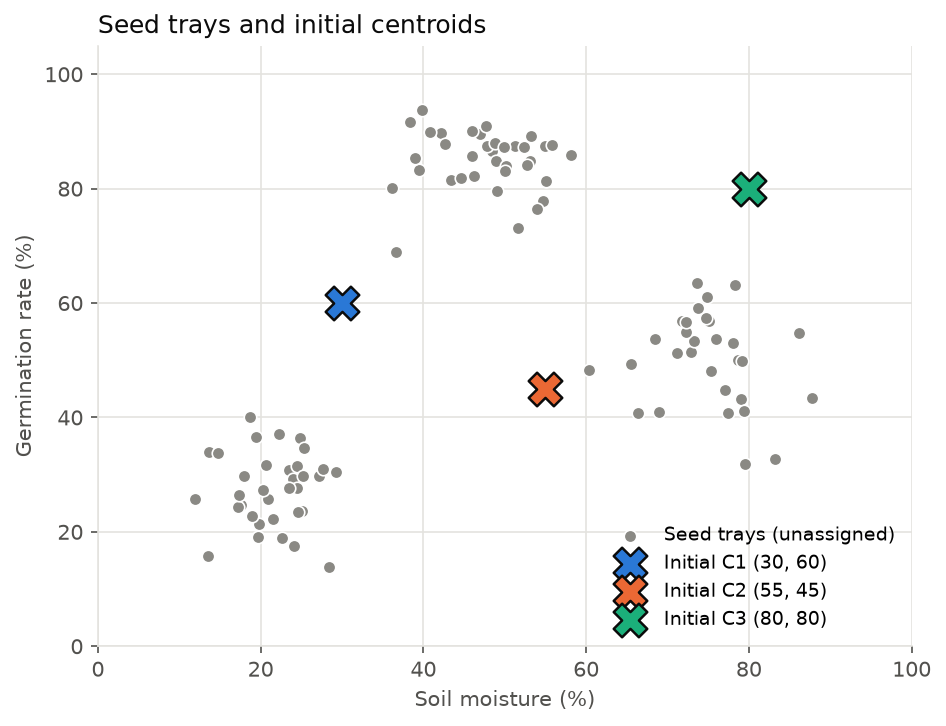
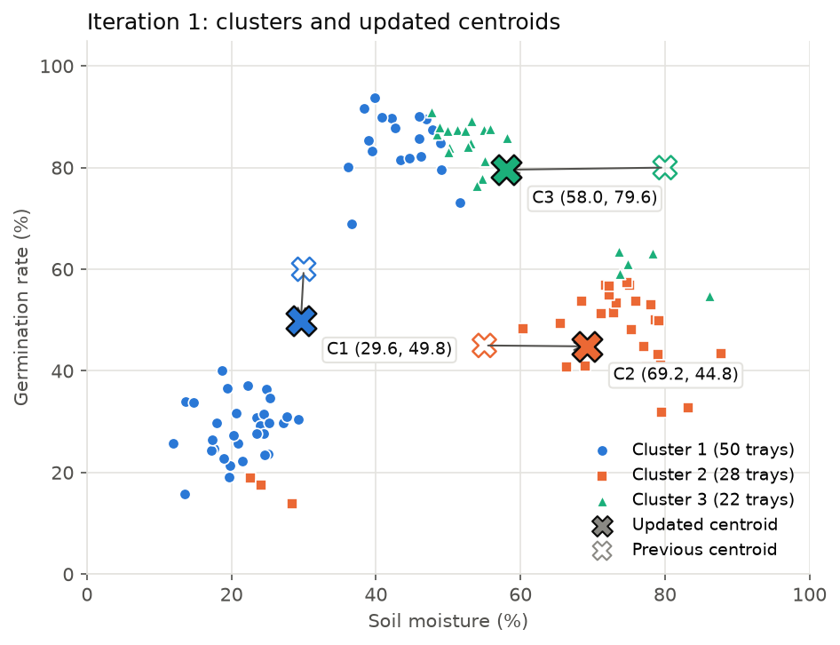
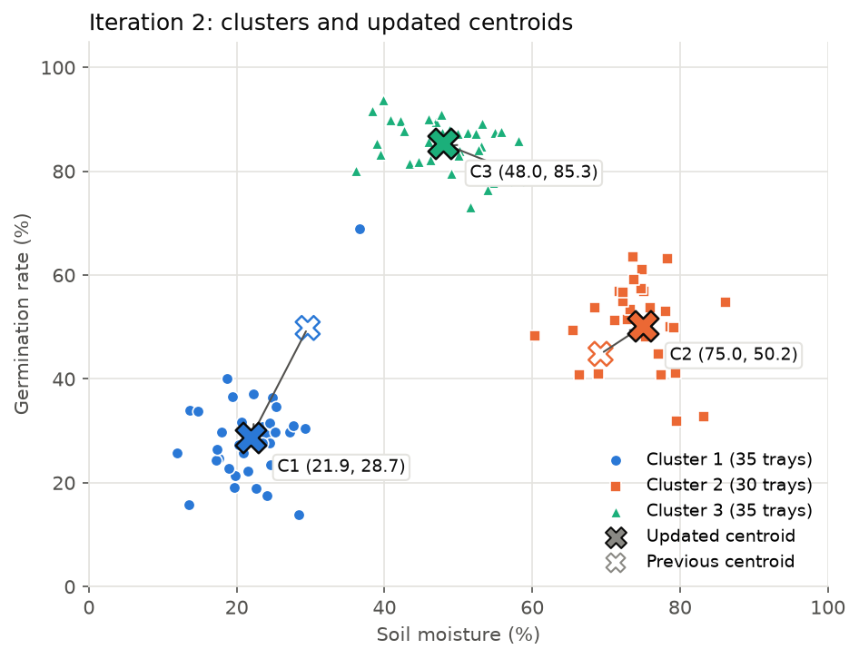
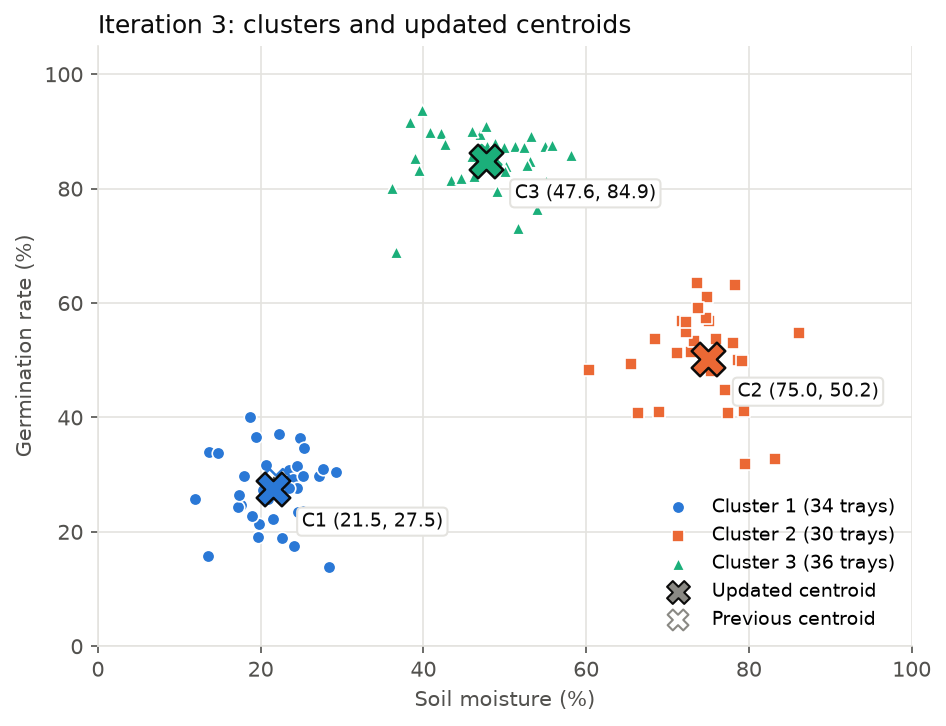
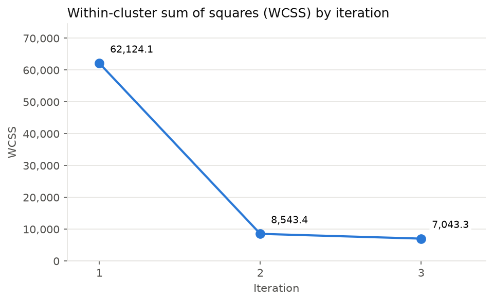

# Part 1 – Manual K-Means Simulation

Step-by-step simulation of the K-Means algorithm (k = 3, 3 iterations) computed by hand
with plain Python — no scikit-learn — so every distance, assignment and centroid update
can be traced.

| File | Content |
|---|---|
| [`../data/seed_trays.csv`](../data/seed_trays.csv) | Dataset (100 records, 2 numerical variables) |
| [`../data/generate_seed_trays_dataset.py`](../data/generate_seed_trays_dataset.py) | Script that generated the dataset |
| [`manual_kmeans.py`](manual_kmeans.py) | The manual K-Means simulation |
| [`results/iteration_1.csv`](results/iteration_1.csv) … [`iteration_3.csv`](results/iteration_3.csv) | Full distance + assignment tables (100 rows each) |
| [`results/centroids.csv`](results/centroids.csv) | Centroids at every iteration |
| [`results/variance.csv`](results/variance.csv) | Within-cluster variance per cluster and iteration |
| [`results/results.json`](results/results.json) | All results in one file (ready to load from Flask) |
| [`../static/images/kmeans_manual/`](../static/images/kmeans_manual/) | Scatter plots and variance chart |

Reproduce everything from the project root:

```bash
python data/generate_seed_trays_dataset.py
python kmeans_manual/manual_kmeans.py
```

---

## 1. Dataset context

A plant nursery sows **100 seed trays** under different irrigation routines. Fourteen days
after sowing, two measurements are taken from each tray:

| Variable | Meaning | Range in the data |
|---|---|---|
| `Soil_Moisture_Percent` (x) | Average volumetric moisture of the tray's substrate (%). Low values mean dry soil; high values mean waterlogged soil. | 11.9 – 87.7 % |
| `Germination_Rate_Percent` (y) | Percentage of the seeds in the tray that germinated. | 13.8 – 93.7 % |

Moisture is one of the main drivers of germination. Seeds need water to start growing,
but too much water pushes out oxygen and makes seeds rot. So the relationship isn't
linear, and the nursery wants to know which irrigation profiles exist among its trays.
That is a clustering problem because there's no label to predict. Both variables are
percentages on the same 0–100 scale, so the Euclidean distance can be computed directly
without normalizing the data.

## 2. Initial centroids

The three initial centroids were chosen by hand, spread across the plane, and on purpose
not at the visual centers of the point groups, so the iterations can show how the
algorithm corrects them:

| Centroid | Soil moisture (%) | Germination (%) |
|---|---:|---:|
| C1 | 30.00 | 60.00 |
| C2 | 55.00 | 45.00 |
| C3 | 80.00 | 80.00 |



## 3. Procedure of each iteration

For every tray *i* and centroid *C<sub>k</sub>*:

1. **Distance** – d(i, C<sub>k</sub>) = √((x<sub>i</sub> − x<sub>Ck</sub>)² + (y<sub>i</sub> − y<sub>Ck</sub>)²)
2. **Assignment** – the tray goes to the cluster with the smallest distance.
3. **Update** – each new centroid is the mean of the x and y values of its trays.

*Worked example (iteration 1, tray T001 = (39.4, 83.2)):*
d(T001, C1) = √((39.4 − 30)² + (83.2 − 60)²) = √(88.36 + 538.24) = **25.03**,
d(T001, C2) = 41.26, d(T001, C3) = 40.73 → T001 is assigned to **C1**.

The tables below show the first 10 trays of each iteration. The complete 100-row tables
are in `results/iteration_<k>.csv`.

### Iteration 1 (distances to the initial centroids)

| Tray | Moisture (%) | Germination (%) | d(C1) | d(C2) | d(C3) | Cluster |
|---|---:|---:|---:|---:|---:|:---:|
| T001 | 39.4 | 83.2 | 25.03 | 41.26 | 40.73 | C1 |
| T002 | 25.1 | 23.7 | 36.63 | 36.71 | 78.64 | C1 |
| T003 | 23.5 | 30.8 | 29.91 | 34.55 | 74.92 | C1 |
| T004 | 46.9 | 89.5 | 34.00 | 45.23 | 34.44 | C1 |
| T005 | 72.9 | 51.5 | 43.73 | 19.04 | 29.37 | C2 |
| T006 | 19.7 | 19.1 | 42.18 | 43.78 | 85.70 | C1 |
| T007 | 13.7 | 34.0 | 30.69 | 42.74 | 80.70 | C1 |
| T008 | 71.8 | 56.9 | 41.91 | 20.59 | 24.51 | C2 |
| T009 | 24.5 | 31.5 | 29.03 | 33.35 | 73.71 | C1 |
| T010 | 48.4 | 86.6 | 32.34 | 42.12 | 32.28 | C3 |

| Cluster | Trays | New centroid (moisture, germination) |
|---|---:|---|
| C1 | 50 | (29.61, 49.81) |
| C2 | 28 | (69.24, 44.82) |
| C3 | 22 | (58.03, 79.59) |

Because C1 started between the dry trays and the high-germination trays, it captures
**50 trays from two different groups**. C3 started too far to the right and splits the
high-germination group with C1.



### Iteration 2 (distances to the centroids from iteration 1)

| Tray | Moisture (%) | Germination (%) | d(C1) | d(C2) | d(C3) | Cluster |
|---|---:|---:|---:|---:|---:|:---:|
| T001 | 39.4 | 83.2 | 34.79 | 48.62 | 18.97 | C3 |
| T002 | 25.1 | 23.7 | 26.50 | 48.94 | 64.87 | C1 |
| T003 | 23.5 | 30.8 | 19.97 | 47.84 | 59.77 | C1 |
| T004 | 46.9 | 89.5 | 43.29 | 49.95 | 14.90 | C3 |
| T005 | 72.9 | 51.5 | 43.32 | 7.61 | 31.78 | C2 |
| T006 | 19.7 | 19.1 | 32.27 | 55.82 | 71.61 | C1 |
| T007 | 13.7 | 34.0 | 22.43 | 56.59 | 63.58 | C1 |
| T008 | 71.8 | 56.9 | 42.78 | 12.35 | 26.54 | C2 |
| T009 | 24.5 | 31.5 | 19.01 | 46.68 | 58.62 | C1 |
| T010 | 48.4 | 86.6 | 41.31 | 46.69 | 11.91 | C3 |

| Cluster | Trays | New centroid (moisture, germination) |
|---|---:|---|
| C1 | 35 | (21.91, 28.67) |
| C2 | 30 | (75.01, 50.21) |
| C3 | 35 | (47.96, 85.34) |

**26 trays changed cluster.** C3 moved left and took the high-germination trays
(e.g. T001 and T004), C2 took the remaining wet trays, and C1 moved down to the dry
trays. The three natural groups are now almost fully separated.



### Iteration 3 (distances to the centroids from iteration 2)

| Tray | Moisture (%) | Germination (%) | d(C1) | d(C2) | d(C3) | Cluster |
|---|---:|---:|---:|---:|---:|:---:|
| T001 | 39.4 | 83.2 | 57.27 | 48.55 | 8.83 | C3 |
| T002 | 25.1 | 23.7 | 5.91 | 56.52 | 65.74 | C1 |
| T003 | 23.5 | 30.8 | 2.66 | 55.05 | 59.77 | C1 |
| T004 | 46.9 | 89.5 | 65.76 | 48.31 | 4.30 | C3 |
| T005 | 72.9 | 51.5 | 55.87 | 2.48 | 42.03 | C2 |
| T006 | 19.7 | 19.1 | 9.82 | 63.46 | 72.01 | C1 |
| T007 | 13.7 | 34.0 | 9.78 | 63.42 | 61.72 | C1 |
| T008 | 71.8 | 56.9 | 57.33 | 7.42 | 37.11 | C2 |
| T009 | 24.5 | 31.5 | 3.84 | 53.87 | 58.73 | C1 |
| T010 | 48.4 | 86.6 | 63.70 | 45.08 | 1.34 | C3 |

| Cluster | Trays | New centroid (moisture, germination) |
|---|---:|---|
| C1 | 34 | (21.47, 27.49) |
| C2 | 30 | (75.01, 50.21) |
| C3 | 36 | (47.65, 84.88) |

**Only 1 tray changed cluster:** T012 = (36.6, 68.9), which moved from C1 to C3
(its distance to C3 is 19.98 vs. 42.83 to C1). C2 did not change at all. Running a
4th iteration gives the same assignments, so the algorithm **has converged**.



### Centroid movement summary

| Iteration | C1 | C2 | C3 |
|---|---|---|---|
| 0 (initial) | (30.00, 60.00) | (55.00, 45.00) | (80.00, 80.00) |
| 1 | (29.61, 49.81) | (69.24, 44.82) | (58.03, 79.59) |
| 2 | (21.91, 28.67) | (75.01, 50.21) | (47.96, 85.34) |
| 3 | (21.47, 27.49) | (75.01, 50.21) | (47.65, 84.88) |

## 4. Variance comparison across iterations

The within-cluster variance of a cluster is the mean squared Euclidean distance from its
trays to its (updated) centroid. The total **WCSS** (within-cluster sum of squares) adds
up the squared distances of all 100 trays.

| Iteration | Var C1 (n) | Var C2 (n) | Var C3 (n) | WCSS | Trays reassigned |
|---|---:|---:|---:|---:|---:|
| 1 | 908.52 (50) | 405.18 (28) | 243.32 (22) | 62,124.06 | – |
| 2 | 110.16 (35) | 97.05 (30) | 50.75 (35) | 8,543.36 | 26 |
| 3 | 57.86 (34) | 97.05 (30) | 60.13 (36) | 7,043.35 | 1 |



- **Iteration 1 → 2:** WCSS falls by **86.2 %** (62,124 → 8,543). Cluster C1 mixed dry
  trays with high-germination trays, which gave it a very large variance (908.5). Once
  the groups separate, every cluster becomes compact.
- **Iteration 2 → 3:** WCSS falls by another **17.6 %** (8,543 → 7,043). The only change
  is tray T012. C1's variance drops by almost half (110.2 → 57.9) because it loses its
  most distant member. C3's variance rises slightly (50.8 → 60.1) because it takes in a
  tray on its edge. The total still decreases, as K-Means guarantees: WCSS never goes up
  from one iteration to the next.
- The shrinking improvement (86 % → 18 % → 0 % in a 4th iteration) is the typical K-Means
  convergence pattern. Most of the work happens in the first iterations.

## 5. Final result and cluster interpretation

| Cluster | Trays | Centroid | Moisture range | Germination range | Profile |
|---|---:|---|---|---|---|
| **C1** | 34 | (21.5 %, 27.5 %) | 11.9 – 29.2 % | 13.8 – 40.0 % | **Under-watered trays** |
| **C3** | 36 | (47.6 %, 84.9 %) | 36.1 – 58.1 % | 68.9 – 93.7 % | **Well-watered (optimal) trays** |
| **C2** | 30 | (75.0 %, 50.2 %) | 60.4 – 87.7 % | 31.9 – 63.5 % | **Over-watered trays** |

- **C1 – Under-watered:** dry substrate (about 21 % moisture) and the lowest germination
  (about 27 %). The seeds don't absorb enough water to break dormancy. Action: increase
  irrigation frequency.
- **C3 – Optimal:** moderate moisture (about 48 %) and the highest germination (about
  85 %). It is also the most compact cluster, so these trays behave consistently. Its
  irrigation routine is the one the nursery should copy.
- **C2 – Over-watered:** waterlogged substrate (about 75 %) with medium germination
  (about 50 %). Excess water lowers oxygen and makes seeds rot, so germination falls even
  though water is plentiful. It has the largest variance (97.1), because the effect of
  waterlogging depends on how saturated each tray is. Action: reduce watering or improve
  drainage.

**Conclusion:** after 3 iterations, K-Means found three irrigation profiles that match
agronomic intuition. Germination peaks at intermediate moisture and falls on both sides.
One variable alone could not show this: moisture separates C1 from C2, but only the
combination with germination rate shows that the middle group performs best. Starting
from poorly placed centroids, the algorithm corrected itself in two iterations and
converged in the third. WCSS fell from 62,124 to 7,043 (−88.7 %).
